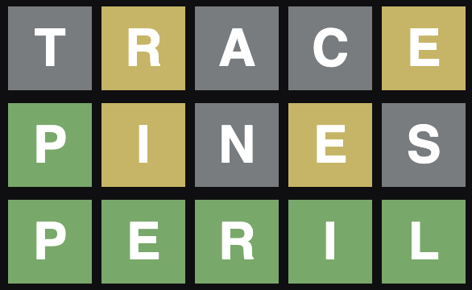
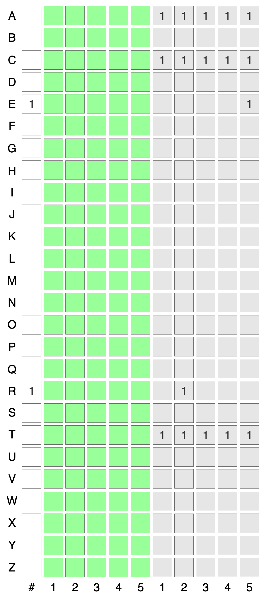
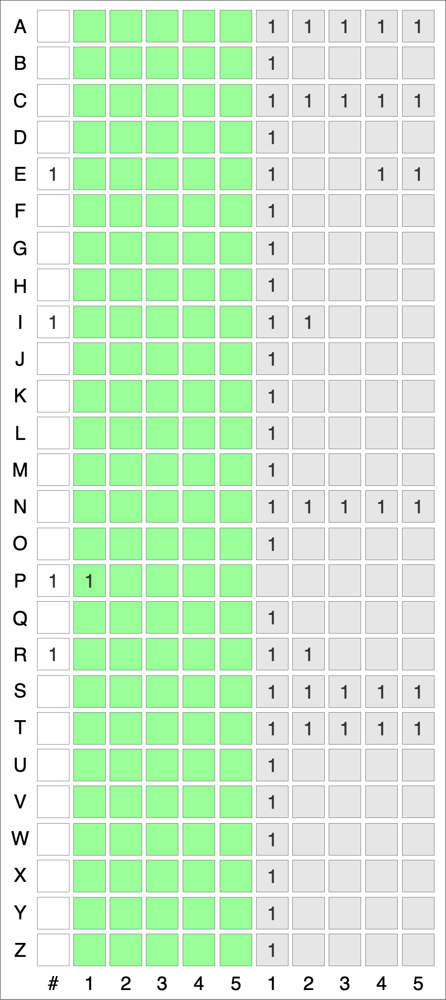
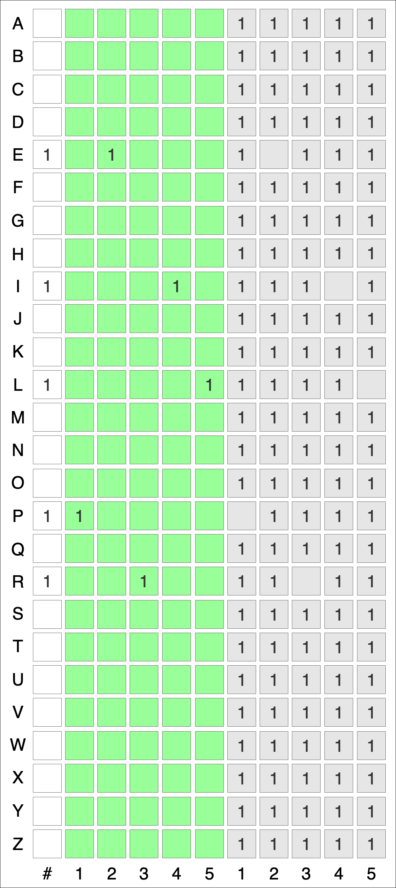
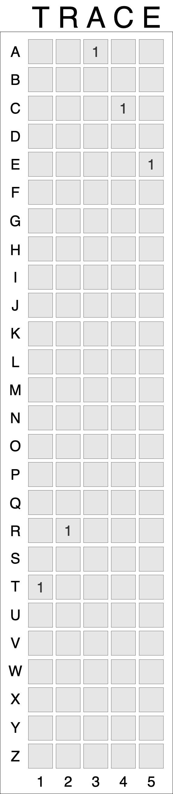
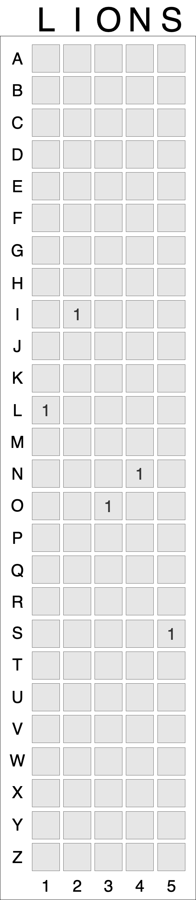
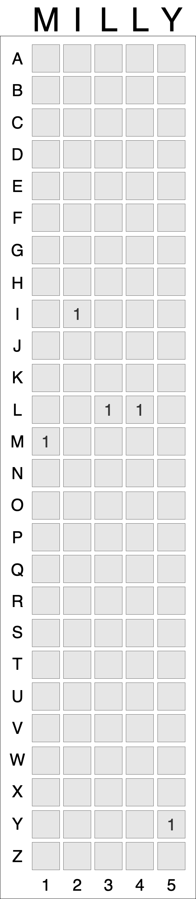

# WordleBot

I've built an AI bot to play **Wordle** using Deep Reinforcement Learning! 

WordleBot Stats:  
- **100% Accuracy**  
- **3.53 Avg Guesses**  
- **~30M Games Played**

[Try WordleBot](https://huggingface.co/spaces/RylieWeaver/WordleBot)  

---

## Summary

At a high level, WordleBot is an A2C (Advantage Actor-Critic) neural network trained with PPO (Proximal Policy Optimization). In addition, the following features distinguish WordleBot and its training from more standard RL (Reinforcement Learning) systems:

1. **Inductive Bias:**  
   WordleBot is constrained to take/not take actions that are clearly optimal/suboptimal, respectively.

2. **Action-State Attention:**  
   WordleBot computes its action probabilities as attention values between the state embedding and the action embeddings.  

3. **Averaged Rewards Over Possible Hidden States**:  
   Rewards are defined as the average rewards over the possible target words given the known game state.  

---

## Background

### Wordle

Wordle is a game run by the New York Times where the goal is to guess an unknown 5-letter 'target word' in as few attempts as possible (with a hard cap at 6 attempts). After each guess, the characters in the guessed word are highlighted according to their presence in the target word:
- **Green**: in the target word at that location
- **Yellow**: in the target word but not at that location, and the total number of greens/yellows does not exceed the count in the target word (characters on the left are given priority to be marked yellow).
- **Grey**: not in the target word or otherwise did not fit green/yellow requirements

  

Besides small changes made since its release, Wordle has a total vocabulary of 12,972 words, of which 2,315 are possible target words. With those vocab sizes and 6 possible guesses, the number of unique Wordle games, defined as different target word or different sequences of guesses, is:
$$12972^6 \times 2315 \approx 10^{24}$$
(quite large).  

### Existing Approaches

There are quite a few different attempts of others for Wordle, including the use of heuristics, other machine learning models, and even brute force algorithms that fully solved the game. Yes, you read that right; Wordle has been solved for the goal of minimizing the average number of guesses with 100% accuracy. The exact stats are 100% accuracy with an average of 3.42 guesses. By definition, there is no chance that WordleBot can beat that optimal algorithm, so why still make it? Firstly, WordleBot is, as far as I know, the most performant deep learning model for playing Wordle, and the insights gained can advise other deep learning enthusiasts on RL for game-playing. Secondly, it was quite fun! As said before, there are quite a few other attempts out there, but here are some significant ones that I've found (note that MinMean Entropy and Maximum Information Gain are equivalent): 
- Greedy MinMean Entropy: [Link1](https://jluebeck.github.io/posts/WordleSolver) [Link2](https://nhsjs.com/wp-content/uploads/2024/04/Using-Information-Theory-to-Play-Wordle-as-Optimally-as-Possible.pdf)  
- [2-Step Maximum Information Gain](https://www.youtube.com/watch?v=v68zYyaEmEA) (inspired me to make this WordleBot!)  
- [Heuristic + Rollout](https://arxiv.org/pdf/2211.10298)  
- [Various Heuristic Comparisons](https://arxiv.org/pdf/2408.11730)  
- [Decision Trees](https://jonathanolson.net/experiments/optimal-wordle-solutions)  
- [Deep Learning](https://andrewkho.github.io/wordle-solver/) (inspired WordleBot's Action-State Attention!)  
- Optimal Strategy: [Link1](https://auction-upload-files.s3.amazonaws.com/Wordle_Paper_Final.pdf) [Link2](https://sonorouschocolate.com/notes/index.php/)  

### Reinforcement Learning

In Reinforcement Learning, a model takes in an input state, produces an action, and then receives feedback on that action in the form of a reward/penalty. Despite its simple core, RL has made a large impact on many machine learning applications, including modern LLMs (large language models) like ChatGPT. In particular, RL has been used to develop world-class or even superhuman level performance at various games, including Chess, Go, DOTA, and Starcraft. Deep Reinforcement Learning uses deep neural networks as the core model architecture, and particularly shines over simpler methods (such as heuristics) when the action space and/or game length is exceedingly large. I was inspired by the success of these models and wanted to better understand how they work, so decided to make a bot on the much simpler game of Wordle.  

---

## WordleBot

### State and Action Representation

The state that is given WordleBot is the concatenation of the known information (alphabet state) and guess number (guess state). 
#### 1. Alphabet State (size 286 = 26 × 11)  
- Each of the 26 letters in the English alphabet is represented with 11 features:
  - 1 for the minimum number of known occurrences of the letter  
  - 5 for positions where the letter is known to occur  
  - 5 for positions where the letter is known to not occur  
- Initialized as all zeros (no known information)

Note that many people would encode 15 features per letter (5 positions x 3 colors: green, yellow, grey). However, this state representation has significant crossover information that I would rather have compressed. A couple examples are:  
- Grey implies "letter nowhere," regardless of the location it's observed  
- Both yellow and grey at a location imply "letter not here"  
- Green implies both "letter here" and "all other letters not here"
This 11-feature representation compresses the state size while keeping all the same information.  

Below is a Wordle game and its alphabet state after each of the three guesses in the game. As a visual aid, squares indicating number of occurrences are white, known occurrence locations are green, and known non-occurrence locations are grey. Note that these colors are a visual aid, not necessarily the visual feedback from the game (a known occurrence position usually results from a green letter, but not always!):

  

  
  
  

#### 2. Guess State (size 6)  
- A one-hot vector representing the current guess number (1-6), which tells WordleBot how far along in the game it is.

#### 3. Action (size 130 = 26 × 5)  
- Each action corresponds to guessing a 5-letter word.  
- The concatenation of five one-hot vectors, one for each position (26 possible letters × 5 positions) represents the actions.

Below are the representations for the word TRACE, LIONS, and MILLY:

  
  &nbsp;&nbsp;&nbsp;&nbsp;&nbsp;&nbsp;&nbsp;&nbsp;&nbsp;&nbsp;&nbsp;&nbsp;&nbsp;&nbsp;
  
  &nbsp;&nbsp;&nbsp;&nbsp;&nbsp;&nbsp;&nbsp;&nbsp;&nbsp;&nbsp;&nbsp;&nbsp;&nbsp;&nbsp;
  

### Inductive Bias  

Some actions in Wordle are clearly optimal or suboptimal given the current state, which can be succinctly stated as rules on the action space (a.k.a. inductive biases). WordleBot is constrained in its training and evaluation to follow three inductive biases in its training and evaluation:  
- **No repeats:** Never guess the same word twice.  
- **Single target word:** If there is only one possible target word, guess that word.  
- **Final guess:** If on the last guess, choose from the remaining possible target words.  

However, if we only constrain the action space with no other changes, the model does not get to experience the negative impacts of those choosing suboptimal actions, depriving it of valuable gradient signals. To address this, we add a KL-divergence loss term (called KL-Guide loss) between the model's raw policy and the constrained policy (a masked, clamped, and renormalized version of the raw policy). This ensures WordleBot’s parameters still receive a learning signal aligned with the inductive biases that we have chosen. In fact, this learning signal is especially rich because it can give feedback on many output probabilities at once, as opposed to experiential learning that only gives feedback on the chosen action. For example, if there is only one possible target word, the KL-Guide loss gives a gradient signal to ALL 12,972 probabilities (namely increase 1 probability and decrease the 12,971 others).  

$$
\mathcal{L}_{\text{KL-Guide}}
= D_{\text{KL}}\!\left(\pi_{\theta} \;\|\; \pi_{\theta,\text{constraints}}\right)
$$

### Action-State Attention

WordleBot computes its probability distribution as:  

$$
P = \text{softmax}_T \!\left( \frac{\phi_1(A) \, \phi_2(S)}{\sqrt{d}} \right)
$$

Where:
- $\phi_1, \phi_2$ are learned functions
- $A$ are the action representations  
- $S$ is the state representation  
- $d$ is the embedding dimension  
- $T$ is the temperature parameter  

Note that when $T = 1$, this is exactly the standard formula for attention weights in Transformers.  

By utilizing embeddings of the state AND actions, rather than just the state, WordleBot is able to transfer information between different actions. For example, if 'FIGHT' is a good guess, then 'MIGHT' probably is too. Most RL systems do not do this, instead embedding the state and projecting to an output dimension the size of the action space. As mentioned in the related existing approaches, [Andrew Ho](https://andrewkho.github.io/wordle-solver/) used a similar mechanism for his deep learning Wordle agent, however that model used a direct dot product without dividing by the square root of the dimensionality.  

### Reward Function

For any given state, there is a set M ⊆ V of possible target words, where V is the whole target vocabulary. WordleBot is given the average reward over **m** possible target words sampled from M, where **m** is a hyperparameter:

$$
R = \frac{1}{m} \sum_{i=1}^{m} R_{i}^{\text{baseline}}
$$

This reduces reward variance, increasing the reward for good guesses (even if not well-fit to the actual target word) and decreasing the reward for lucky guesses.  

For each target word, the baseline reward is defined as the sum of two components:
- **Information gain** via reduction of the possible target words, scaled to [0, 1]   
- **Correct word bonus** of 0.1 if the target word is guessed

### Other Notes
- Normalizing advantages per group helped a lot to improve on harder words.
- Using a replay loader is an option in WordleBot's training. However the latest iteration of WordleBot does not use it because (1) I didn't see a big difference in performance and (2) guessing words sooner helps my avg number of guesses, whether or not it was a hard word, but a replay loader biases the model to care specifically about the hard words.

[LinkedIn](https://www.linkedin.com/in/rylie-weaver/) | [Email](mailto:rylieweaver9@gmail.com) | [GitHub](https://github.com/RylieWeaver)  |  [Try WordleBot](https://huggingface.co/spaces/RylieWeaver/WordleBot)  |  [WordleBot Source Code](https://github.com/RylieWeaver/WordleBot)  

